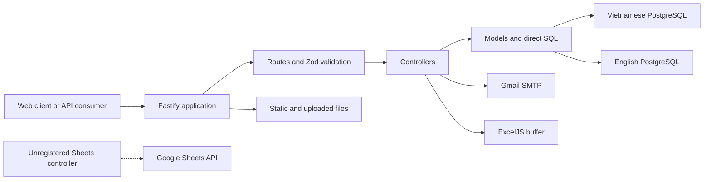

# MakerSpace Backend Project Overview

> This document describes the source reviewed on 4 August 2026. Statements about current behavior are traceable to `src/`, `package.json`, and `.github/workflows/deploy-makerspace.yml`. Items marked as gaps or recommendations are not implemented features.

## 1. System purpose

`makerspace_server` is the REST API for the UEH MakerSpace web platform. It serves bilingual content, products and services, workshop data and bookings, user registration, contact and quotation requests, image uploads, content search, email notifications, and Excel booking exports.

The service is a standalone Node.js/Fastify 5 application written in TypeScript. Persistent data uses direct `pg` SQL without an ORM. Vietnamese and English content reside in separate PostgreSQL databases selected per request.

## 2. Actual responsibility scope

| Area | Implementation | Primary source | Status |
|---|---|---|---|
| HTTP API | Dynamic `/api` or `/makerspace_server/api` prefix | `src/index.ts`, routes | Implemented |
| Database | Lazy language-keyed PostgreSQL pools | `models/db/pool.ts` | Implemented |
| Authentication | HS256 JWT, seven-day expiry, manual checks on four routes | JWT/user code | Partial |
| Authorization | Role claim exists; no active RBAC middleware | auth placeholders | Not enforced |
| Guest registration | Email verification link followed by DB insert | user/mail code | Implemented |
| Google login | Member email lookup only; no Google token verification | `loginUser()` | Simple whitelist |
| Email | Gmail/Nodemailer for verification, bookings, quotations | `mail.ts` | Implemented |
| Upload/static | Multipart upload and local `public` serving | upload middleware/route | Implemented |
| Excel | In-memory booking workbook export | workshops controller | Implemented |
| Google Sheets | Controller exists but has no registered route | registration controller | Unreachable code |
| Search | `ILIKE`, four-table `UNION ALL`, limit 20 | search model | Implemented |
| Cron/queue | No cron, queue, or worker found | repository scan | Absent |
| Cookie session | Plugin registered with `secure:false`; business flows do not use it | bootstrap | Registered, unused |

## 3. Business modules

### Accounts

- Password login checks `accounts.members`, then `accounts.guests`.
- The Google branch authorizes an email found in `accounts.members`.
- Guest registration sends a JWT containing the email and bcrypt hash; `/verify` creates the guest.
- Profile reads support guest/member; profile updates support guests only.

### Workshops and bookings

- `/workshops` exposes six hard-coded records with exact tag filtering and featured filtering.
- DIY and short-course content use PostgreSQL CRUD.
- Bookings start as `pending` in `registrations.workshop_bookings`.
- Operations include lookup, own bookings, absence requests, status changes, deletion, and XLSX export.
- Booking email is best effort and never rolls back the database write.

### Content and people

- CMS resources: news, student life, events, and careers.
- People resources: staff, technicals, and interns.
- Draft fields are stored but list endpoints do not filter drafts.

### Products and services

- Product items/categories use the `products` schema.
- Product prices are parsed from request strings and rendered using `vi-VN`; null/zero becomes the source text meaning “Contact us”.
- The service catalog is process-local static data.
- B2B quotation requests persist to `services.b2b` and trigger requester/admin email.

### In-memory and media modules

- Contact details/inquiries and member registrations are in-memory and reset on restart.
- Uploads are written below `<MEDIA_UPLOAD_FOLDER>/images` on local disk.
- An `onSend` hook rewrites serialized `public/static/images/` strings to absolute URLs.

## 4. System scope diagram

## 5. Declared technology baseline

| Component | Version/configuration |
|---|---|
| CI runtime | Node.js 20 |
| TypeScript | ES2022, NodeNext |
| Framework | `fastify ^5.1.0` |
| Validation | Zod and `fastify-type-provider-zod` |
| Database | PostgreSQL through `pg ^8.13.3` |
| JWT/password | `fast-jwt`, bcrypt cost 10 for guest registration |
| Email | Nodemailer Gmail service |
| File handling | Fastify multipart/static |
| Build | `tsc` followed by `tsc-alias` |

## 6. Database objects referenced by code

| Schema | Tables |
|---|---|
| `accounts` | `members`, `guests` |
| `people` | `staff`, `technicals`, `interns`; unused model also references `users` |
| `posts` | `news`, `events`, `student_life`, `careers` |
| `products` | `items`, `categories` |
| `workshops` | `diy`, `short_courses`; unused route layer for `schedules` |
| `registrations` | `workshop_bookings` |
| `services` | `b2b` |

## 7. Missing handover information

- Authoritative DDL, migrations, seed data, indexes, constraints, and ERD.
- Production infrastructure ownership, backups, restoration, and capacity limits.
- Formal role/status definitions and permission matrix.
- Upload retention, MIME/antivirus policy, shared-storage design.
- Secret rotation and ownership for Gmail, FTP, databases, and deployment webhook.
- SLA, observability, alerting, log retention, incident runbooks, staging, and rollback criteria.
- Test suite and formal frontend API contract.

## 8. Immediate takeover concerns

1. Write/admin/export/upload endpoints have no authentication guard.
2. Source contains secret fallbacks; production must never rely on them.
3. Google login does not validate a Google-issued identity token.
4. Each raw language key can create a pool; every non-`en` key uses VI settings, and each pool permits up to 500 connections.
5. Global language selection uses `?lang=`, while services quotation routes use `x-custom-lang`.
6. CI zips `public` even though a clean checkout currently has no `public` directory.
7. Type-check passed during review; lint reported 85 errors.

