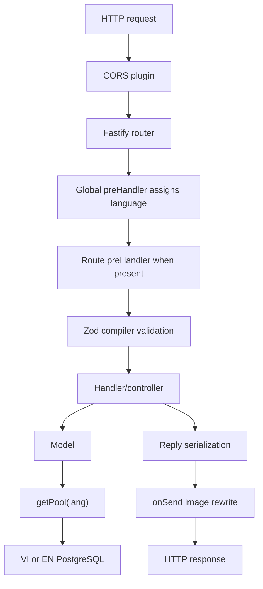
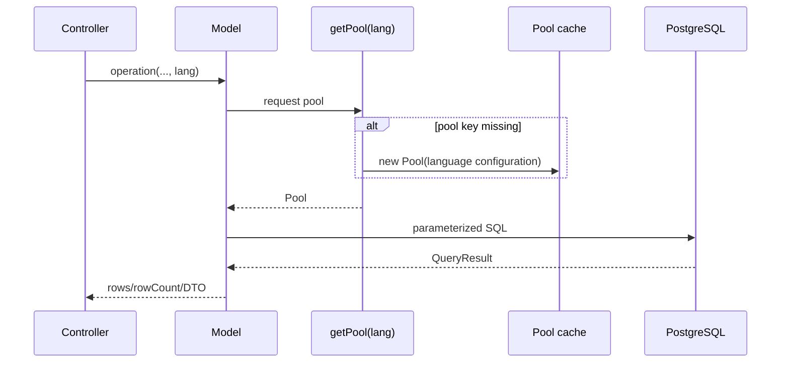
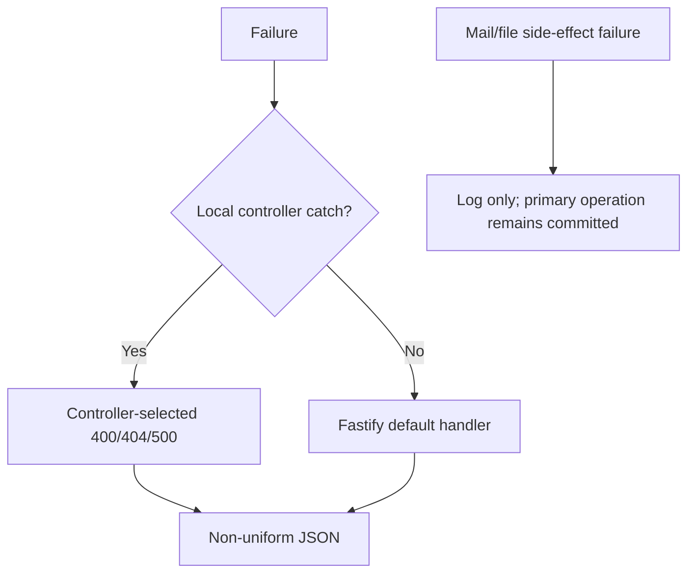

# Backend Architecture

## 1. Architectural style

The application uses a lightweight layered flow, `Route -> Controller -> Model -> PostgreSQL`. It resembles server-side MVC without views, but it does not consistently have a service layer.

| Layer | Actual responsibility | Notable exception |
|---|---|---|
| Bootstrap | Fastify creation, plugins, hooks, static server, routes, listen | One IIFE in `src/index.ts` |
| Route | Method/path, schema, handler adapter | Several routes contain auth and 404 logic |
| Controller | Orchestration, responses, mail, Excel | Workshop controller carries significant business logic |
| Model | Direct SQL or in-memory store | No ORM/repository abstraction/transaction helper |
| Utilities | JWT, email, URL, error class | `AppError` and `formatImageUrl` are unused |
| Middleware/hooks | Language, upload path, image rewrite | Auth hook/middleware are no-ops |

## 2. Bootstrap order

1. Fastify logger, trailing-slash normalization, maximum parameter length 1000.
2. Credentialed CORS with callback-based origin filtering.
3. Create `public/` at runtime and register static serving.
4. Sensible and Zod compiler plugins.
5. Cookie and session plugins; session cookie is `secure:false`.
6. Multipart limits: 20,000,000 bytes per file and 10 files, although the handler reads one.
7. Global `preHandler`: `request.lang = request.query.lang ?? "vi"`.
8. Root routes, then global image response rewrite.
9. Eighteen prefixed route groups.
10. Listen on `0.0.0.0:<PORT>`; startup failure exits the process.

## 3. Validation and request behavior

- Runtime language input is not validated against the declared `vi|en` type.
- Routes with Zod `body`, `params`, or `querystring` validate before handlers.
- Careers imports schemas but validates manually in the controller.
- Booking find/absence, profile update, several ids, services delete, and upload content have no complete runtime schemas.
- No custom global error handler means Fastify owns validation/unhandled error payloads.
- Responses mix returned objects and explicit `reply.send`, with no common envelope.

The `onSend` hook performs a string replacement only when serialized payload contains `"public/static/images/`. It uses `SERVER_PROTOCOL`, `SERVER_DOMAIN`, and `BASE_PATH`.

## 4. Database architecture

- Pool cache key is the raw `lang` string.
- English settings apply only to exact `en`; every other value uses VI credentials.
- Settings: max 500, idle timeout 30 seconds, connection timeout 2 seconds.
- Supabase-host strings enable TLS with certificate verification disabled.
- No startup connection probe, graceful pool close, retry policy, or transaction abstraction exists.

Storage types are mixed: PostgreSQL, module-local arrays/objects, local filesystem, and static hard-coded workshop/service data.

## 5. Authentication and authorization boundaries

- Session JWTs are HS256, signed with `SESSION_TOKEN_SECRET`, and expire in seven days.
- Clients send a raw token in `Authorization`; Bearer parsing is absent.
- Explicit verification exists only for session-check, profile read/update, and own bookings.
- `role` is signed but never checked.
- Cookie sessions are registered but unused.
- `JWT_SECRET` is loaded but unused.
- The auth hook and middleware return immediately and are not registered.

## 6. External side effects

- Gmail transporter is created at module load. Booking and quotation database writes precede best-effort email.
- Upload writes local files; people update/delete asynchronously removes prior files without a boundary re-check.
- XLSX export loads every booking into memory.
- Google Sheets registration code exists but is not reachable by any route.

## 7. Error flow and architectural limits

There is no global domain error mapping, dependency injection, database transaction boundary, external cache, rate limiting, CSRF/Helmet integration, audit log, generated OpenAPI definition, or graceful shutdown.

