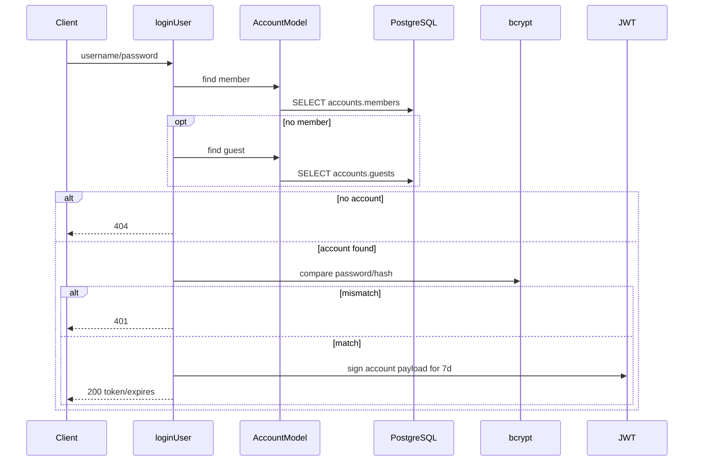
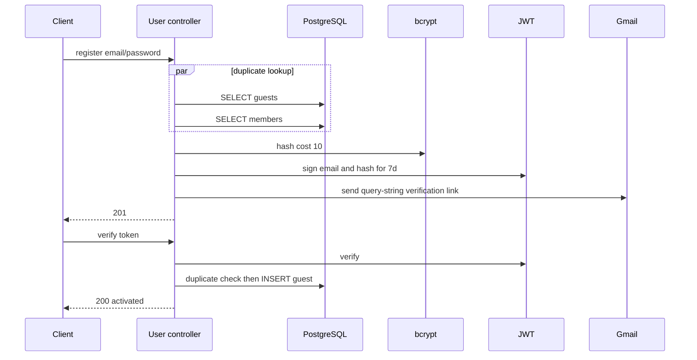

# Authentication and Authorization

## 1. Current-state conclusion

The service issues and verifies JWTs, but it has no globally enforced authorization architecture. Four endpoints verify a token manually. CMS, people, products, admin booking operations, quotation administration, export, and upload are unprotected in current code.

## 2. Token contract

| Property | Current behavior |
|---|---|
| Library/algorithm | `fast-jwt`, HS256 on signing |
| Secret | `SESSION_TOKEN_SECRET` |
| Lifetime | Seven days |
| Transport | Raw JWT in `Authorization` |
| Refresh/revocation/logout | None |
| Cookie session | Plugin registered but unused |

Session payload: `userId`, `username`, `role`. Verification payload: `username`, `passwordHash`. Both use the same key and lifetime. `JWT_SECRET` is unused.

## 3. Password login

Account status, verified/disabled state, and role permission are not checked.

## 4. Google email whitelist

When client body says `auth_provider: "google"`, code queries `accounts.members` by email and signs a token immediately. It does not receive or validate a Google ID/access token, audience, issuer, signature, nonce, or verified-email claim. This is an email whitelist and is vulnerable to impersonation by anyone who knows an allowed email.

## 5. Guest registration and activation

There is no pending-registration table. The password hash travels inside a URL token, locale is always `/vi/login`, and concurrent verification relies on DB constraints without conflict mapping.

## 6. Enforcement matrix

| Route | Authentication | Authorization |
|---|---|---|
| Session check | Verify raw token | No account lookup |
| Profile GET | Verify and lookup guest/member | Any found account |
| Profile PUT | Verify and lookup guest | Guests only |
| My registrations | Verify, resolve account email | Email-scoped booking query |
| All other routes | None | None |

The role claim is never compared. `authHook` and `authMiddleware` are empty and unregistered. `UserModel.createAdminUser()` is unused.

## 7. Session-check caveat

The session-check response calculates `expires` as request time plus seven days instead of reading JWT `exp`. It does not issue a new token. A valid JWT can pass even after its account is deleted because this route does not query the account.

## 8. Security remediation priorities

### Immediate

1. Deny by default and protect every write/admin/export/upload endpoint with real authentication and RBAC.
2. Verify Google ID tokens server-side before member whitelist evaluation.
3. Remove source secret fallbacks, rotate previously used secrets, and require production environment values.
4. Parse the standard Bearer scheme and redact tokens/passwords from logs.

### High priority

- Separate short-lived, purpose/audience-bound verification tokens from sessions; do not put password hashes in URL tokens.
- Add refresh rotation or a revocable session strategy, logout, and account status checks.
- Map invalid/expired JWTs to consistent 401 responses.
- Add rate limiting and brute-force controls.
- Either configure secure/httpOnly/sameSite cookies and use them, or remove unused session plugins.
- Add booking ownership checks and prevent public PII exports.

### Target permission domains

Define at least public reader, guest/member, content editor, booking operator, and administrator roles, backed by audit logging for writes, status changes, deletes, and exports.

