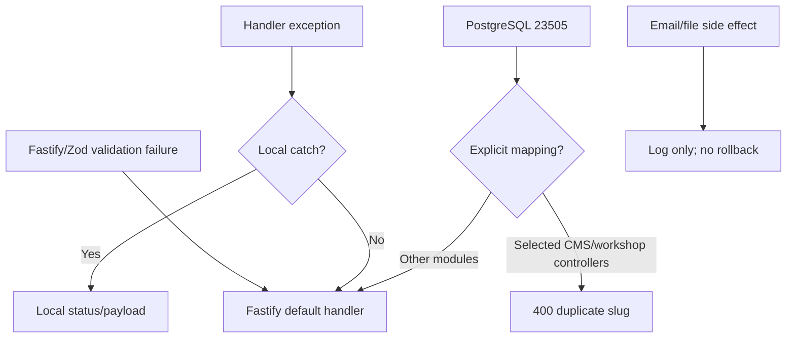

# Error Handling

## 1. Current model

No `server.setErrorHandler` is installed. Failures follow three paths:

1. Local CRUD controller `try/catch` chooses 400/404/500.
2. Uncaught route/controller exceptions go to Fastify defaults.
3. Email and image-delete failures are logged while the primary operation remains successful.

`AppError(message,statusCode)` exists but is unused.



## 2. Observed status codes

| Code | Use |
|---|---|
| 200 | Most reads/updates/deletes and several creates |
| 201 | Guest registration; unreachable Sheets controller |
| 400 | Missing auth input/query/file, duplicate slug, validation |
| 401 | Wrong password or explicit session failure |
| 403 | Member profile update denial |
| 404 | Missing account/resource |
| 409 | Duplicate registration/already activated |
| 500 | Generic catches and unhandled failures |

No 204, 422, 429, or 503 behavior is implemented.

## 3. Non-uniform payloads

```json
{"message":"Internal Server Error"}
```

```json
{"message":"Validation error","errors":[{"path":["title"],"message":"..."}]}
```

```json
{"status":400,"message":"Query parameter 'q' is required"}
```

Search 500 responses also expose raw `error.message`. Fastify validation and unhandled payloads depend on framework/compiler versions. Several Vietnamese source strings show encoding corruption.

## 4. Module behavior

| Area | Special mapping | Gap |
|---|---|---|
| News/events/student life/DIY/courses | `23505` to 400 | Other DB errors become 500/default |
| Careers | Manual Zod to 400 and duplicate mapping | Route-level schema unused |
| People | Entity-specific 404 | No unique/FK mapping |
| Products | Inline null/boolean 404 | Other failures default |
| Booking | Find has 404 | Status/delete missing rows throw and may become 500 |
| Users | Several local 4xx statuses | JWT failures in profile/verify can become 500 |
| Search | Missing q 400 | Raw internal message on 500 |
| Services | Little local catching | Default error response |
| Upload | Missing file 400; handler catch 500 | PreHandler failures bypass handler catch |

## 5. Atomicity gaps

- Booking and quotation DB writes precede best-effort email.
- Booking status commits before notification.
- People DB changes precede asynchronous old-file deletion.
- Upload can leave a partial file after stream failure.
- Multi-query product and verification flows do not use transactions.

## 6. Logging

Fastify logging is enabled, but application code mixes `server.log`, `console.error`, and `console.log`. There is no domain-structured logging, application correlation identifier, audit trail, or explicit redaction policy.

## 7. Recommended error contract

```json
{"error":{"code":"RESOURCE_NOT_FOUND","message":"Resource not found","details":[],"requestId":"<id>"}}
```

Introduce typed domain errors and one global handler that maps Zod/Fastify/PostgreSQL/dependency failures without returning stack or raw database messages. Normalize create/delete statuses, add request IDs and redaction, adopt outbox/retry semantics for email, and lock the contract with route tests.

