# Business Processes and Sequence Diagrams

> Diagrams include only source-backed components. Most modules have no separate service layer; their controllers perform orchestration. The repository contains no active cron job, queue, or worker.

## 1. Bilingual database selection

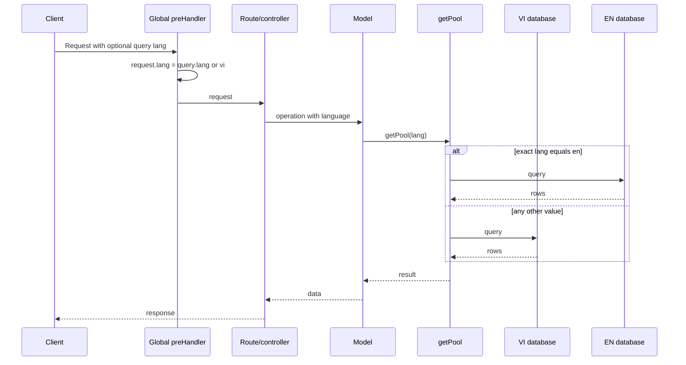

Quotation routes are the exception and read `x-custom-lang`; search reads query `lang` itself.

## 2. Password and Google-whitelist login

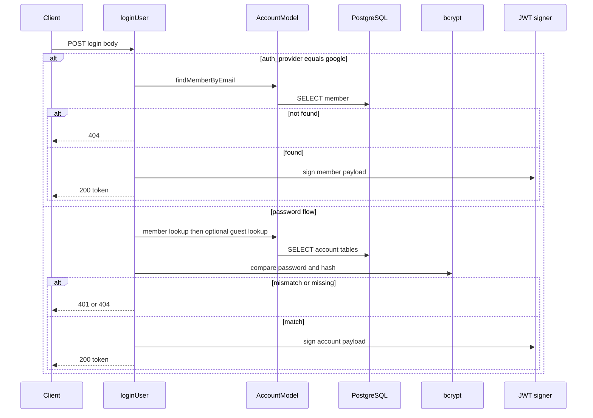

No Google API or Google-issued token is involved in the Google branch.

## 3. Guest registration and activation

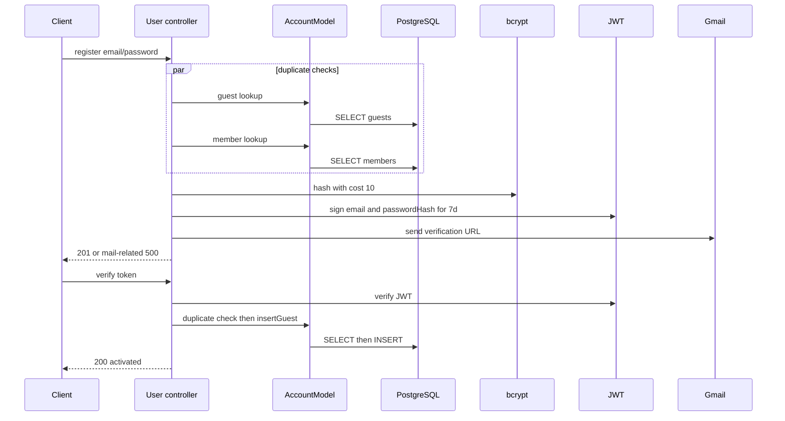

## 4. CMS create/update

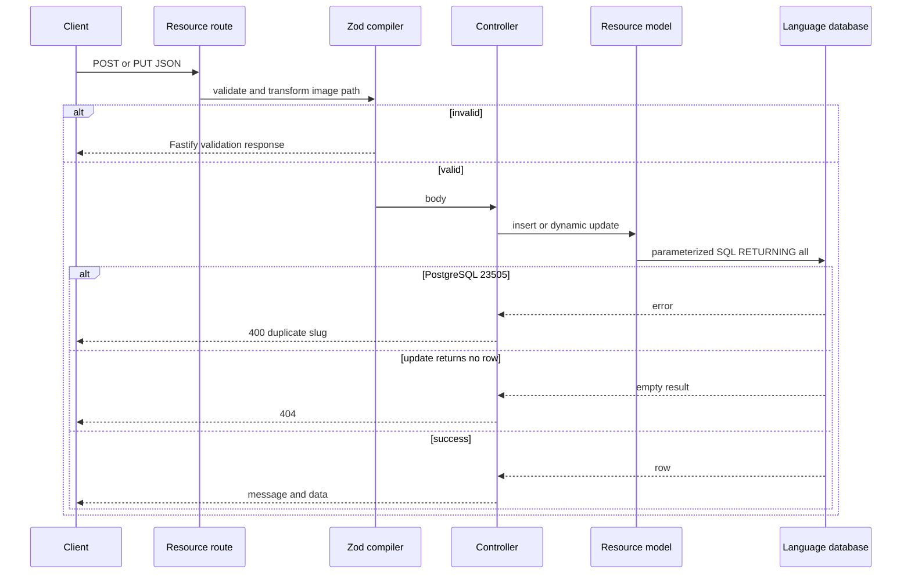

Careers validates manually in its controller. No authentication guard exists on these routes.

## 5. Product create/update

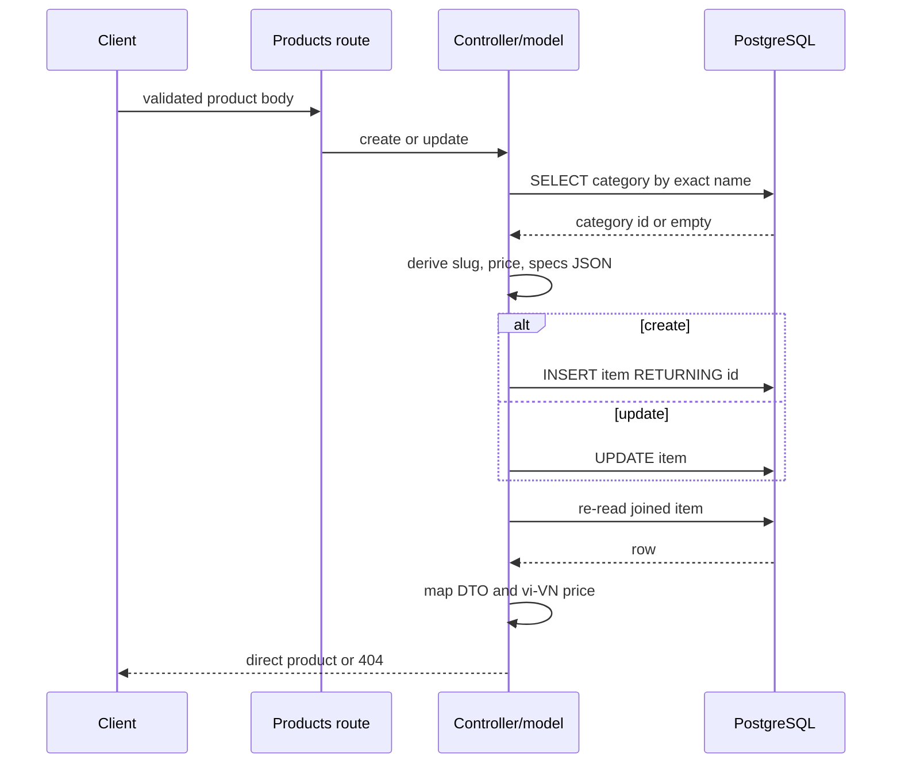

## 6. File upload and static serving

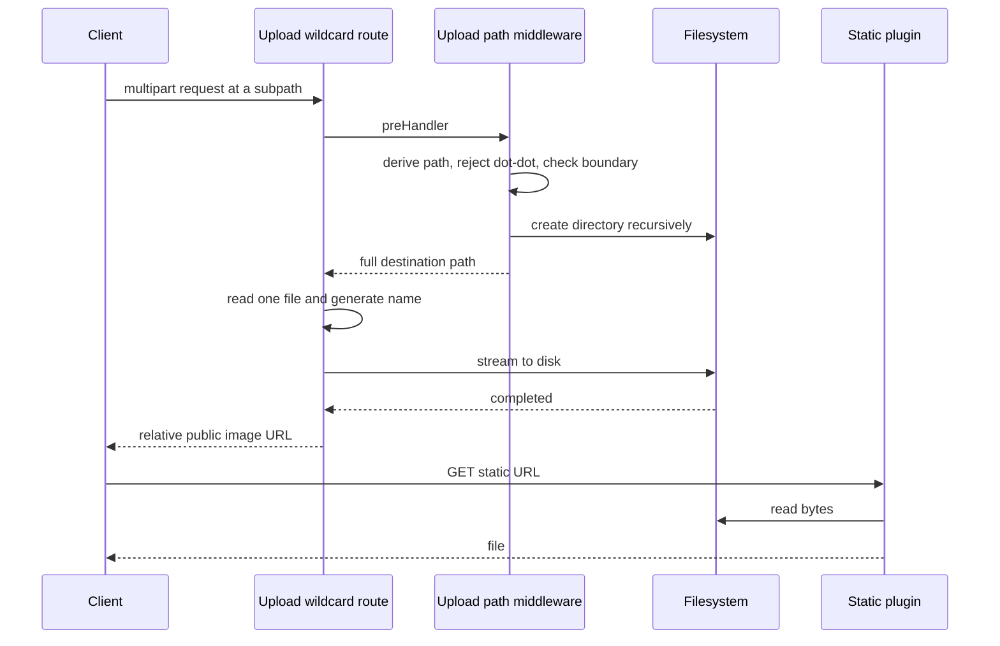

The handler has no MIME allowlist or authentication.

## 7. Workshop booking submission

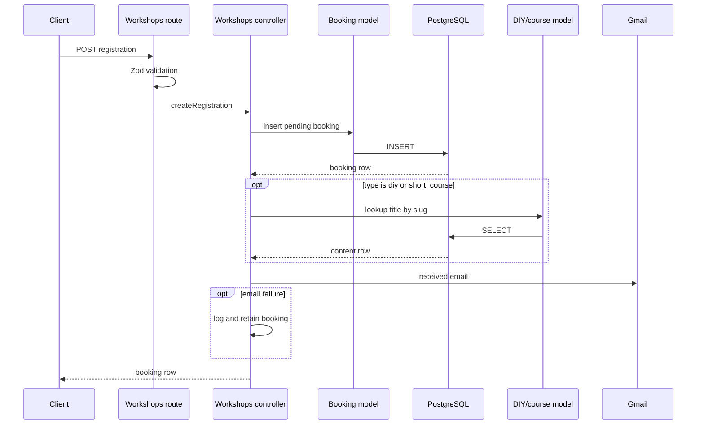

## 8. Booking approval/cancellation

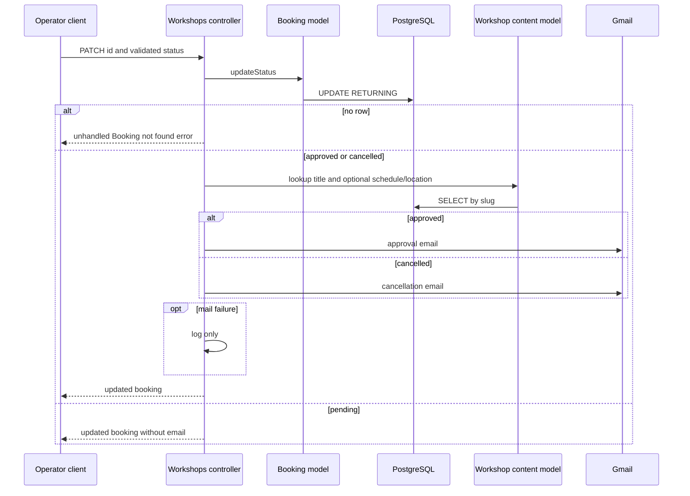

The operator endpoint currently has no authentication or RBAC.

## 9. Service quotation request

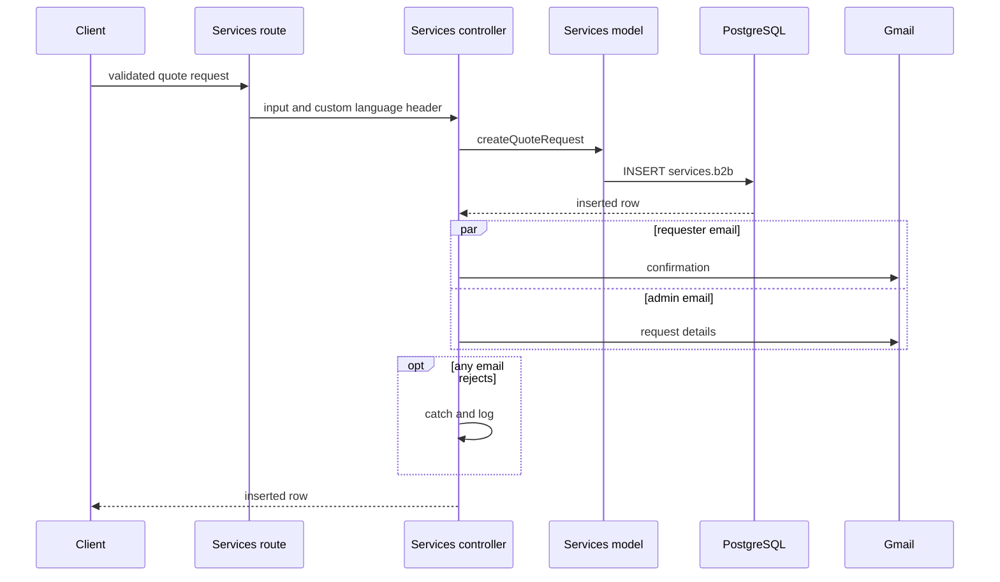

## 10. Global search

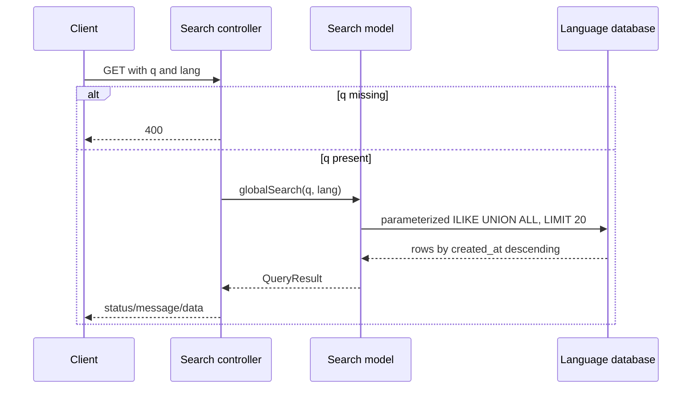

## 11. XLSX booking export

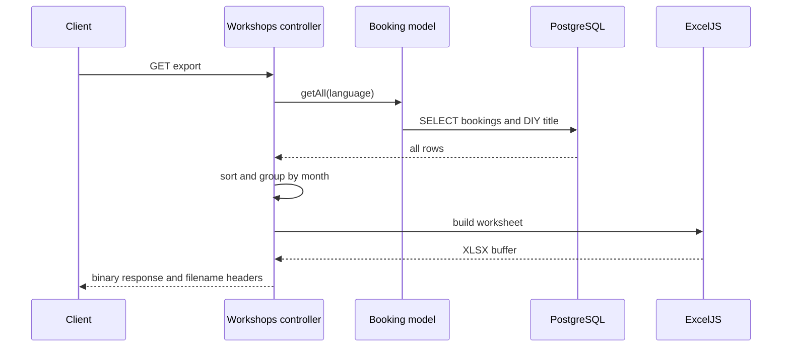

The flow is unauthenticated, unpaginated, and non-streaming.

## 12. Deployment workflow

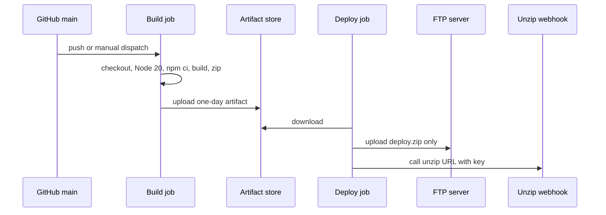

## 13. Cron jobs and synchronization

No active cron, runtime scheduler, queue, worker, or synchronization route exists. `schedules.model.ts` has table CRUD but no controller/route. The Google Sheets controller can append a row but is not registered, so it is not a runtime business workflow.

