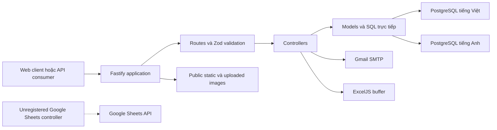

# Tổng quan dự án Backend MakerSpace

> Tài liệu này phản ánh trạng thái source tại thời điểm rà soát ngày 04/08/2026. Mọi mô tả về hành vi hiện hành đều được truy vết từ `src/`, `package.json` và `.github/workflows/deploy-makerspace.yml`. Nội dung gắn nhãn "Khoảng trống" hoặc "Khuyến nghị" không phải là tính năng đang tồn tại.

## 1. Mục đích hệ thống

`makerspace_server` là dịch vụ REST API cho nền tảng UEH MakerSpace. Server cung cấp nội dung song ngữ, danh mục sản phẩm và dịch vụ, quản lý workshop, đăng ký người dùng, nhận yêu cầu liên hệ/báo giá, upload ảnh, tìm kiếm nội dung và gửi email nghiệp vụ.

Ứng dụng chạy như một tiến trình Node.js độc lập, dùng Fastify 5 và TypeScript. Dữ liệu bền vững được truy vấn trực tiếp bằng `pg`; dự án không dùng ORM. Nội dung tiếng Việt và tiếng Anh nằm trong hai database PostgreSQL riêng, được chọn theo `request.lang`.

## 2. Phạm vi trách nhiệm thực tế

| Phạm vi | Hiện thực | Nguồn chính | Trạng thái |
|---|---|---|---|
| HTTP API | Fastify, route prefix động `/api` hoặc `/makerspace_server/api` | `src/index.ts`, `src/routes/*` | Có |
| Database | Hai pool PostgreSQL lazy-init theo ngôn ngữ | `src/models/db/pool.ts` | Có |
| Xác thực | JWT HS256, thời hạn 7 ngày; kiểm tra thủ công ở một số route | `src/utils/jwt.ts`, `user.controller.ts` | Có một phần |
| Phân quyền | Payload có `role`, nhưng không có middleware/RBAC enforcement | `auth.middleware.ts`, `auth.hook.ts` | Chưa có hiệu lực |
| Đăng ký tài khoản | Guest đăng ký bằng email, xác minh qua link email | `user.controller.ts`, `mail.ts` | Có |
| Google login | Chỉ kiểm tra email có trong `accounts.members`; không xác minh Google ID token | `loginUser()` | Whitelist đơn giản |
| Email | Gmail qua Nodemailer: xác minh, booking, báo giá | `src/utils/mail.ts` | Có |
| Upload/static | Multipart một file/lần, tối đa 20 MB; static từ `public/` | `upload.route.ts`, `processUploadPath.ts` | Có |
| Excel | Xuất booking thành `.xlsx` | `workshops.controller.ts` | Có |
| Google Sheets | Controller ghi sheet tồn tại nhưng không được route nào đăng ký | `registration.controller.ts` | Code không truy cập được |
| Search | `ILIKE` và `UNION ALL` trên bốn bảng, tối đa 20 kết quả | `search.model.ts` | Có |
| Cron/queue | Không tìm thấy cron, queue hoặc worker | toàn repository | Không có |
| Session cookie | Plugin được đăng ký với cookie `secure: false`, nhưng business flow không đọc session store | `src/index.ts` | Đăng ký nhưng không dùng |

## 3. Module nghiệp vụ

### 3.1 Người dùng và tài khoản

- Đăng nhập bằng password cho `accounts.members` hoặc `accounts.guests`.
- Nhánh `auth_provider === "google"` cho phép đăng nhập nếu email tồn tại trong `accounts.members`.
- Đăng ký guest tạo token chứa `username` và `passwordHash`, gửi email; bản ghi chỉ được insert khi gọi `/verify`.
- Xem profile cho member hoặc guest; chỉ guest được cập nhật `fullname`, `phone`.
- Kiểm tra tính hợp lệ của session token.

### 3.2 Workshop và đăng ký

- `/workshops` trả về sáu workshop hard-code từ `workshops.model.ts`; hỗ trợ lọc chính xác theo `tag` và featured.
- `/workshops/diy` và `/workshops/short_courses` là CRUD PostgreSQL.
- Booking lưu trong `registrations.workshop_bookings`, trạng thái ban đầu `pending`.
- Hỗ trợ tra cứu booking, booking của tài khoản, yêu cầu vắng, duyệt/hủy, xóa và xuất Excel.
- Email booking là best-effort: lỗi gửi mail bị log nhưng không rollback database.

### 3.3 Nội dung CMS

- Bài viết: news, student life, events, careers.
- Nhân sự: staff, technicals, interns.
- Mỗi nhóm có list/detail/create/update/delete; news/events/student life có detail theo slug, careers cũng có slug.
- Trạng thái `draft` nằm trong dữ liệu nhưng list API không lọc draft.

### 3.4 Sản phẩm và dịch vụ

- Product items và categories lưu trong schema `products`.
- Giá được chuyển từ chuỗi request sang số, sau đó format lại theo locale `vi-VN`; giá 0/null thành "Liên hệ".
- Catalog dịch vụ là mảng tĩnh trong process.
- Yêu cầu báo giá lưu vào `services.b2b`, sau đó gửi email cho người gửi và quản trị viên.

### 3.5 Liên hệ và thành viên

- Contact details, contact inquiries và member registrations là dữ liệu in-memory.
- Dữ liệu inquiry/registration mất khi process restart và không đồng bộ giữa nhiều instance.

### 3.6 Media và tiện ích

- Upload vào `<MEDIA_UPLOAD_FOLDER>/images/<wildcard>/`.
- `onSend` thay chuỗi `public/static/images/` trong JSON response thành URL tuyệt đối.
- Có health endpoint ở root và dưới `/api/utils`.

## 4. Sơ đồ phạm vi

## 5. Công nghệ và phiên bản khai báo

| Thành phần | Khai báo |
|---|---|
| Runtime CI | Node.js 20 |
| TypeScript target/module | ES2022 / NodeNext |
| Web framework | `fastify ^5.1.0` |
| Validation | `zod ^3.23.8`, `fastify-type-provider-zod ^4.0.2` |
| Database | PostgreSQL qua `pg ^8.13.3` |
| JWT | `fast-jwt ^5.0.2` |
| Password | `bcrypt ^5.1.1`, cost 10 khi đăng ký guest |
| Mail | `nodemailer ^6.10.1`, Gmail service |
| Upload | `@fastify/multipart ^9.0.1` |
| Excel | `exceljs ^4.4.0` |
| Build | `tsc`, sau đó `tsc-alias` |

## 6. Các schema/table được code truy cập

| Schema | Tables |
|---|---|
| `accounts` | `members`, `guests` |
| `people` | `staff`, `technicals`, `interns`; `users` chỉ xuất hiện trong model không được dùng |
| `posts` | `news`, `events`, `student_life`, `careers` |
| `products` | `items`, `categories` |
| `workshops` | `diy`, `short_courses`; `schedules` chỉ có model không được route dùng |
| `registrations` | `workshop_bookings` |
| `services` | `b2b` |

## 7. Thông tin còn thiếu trong repository

> Các mục dưới đây không thể xác nhận từ source và phải được team vận hành cung cấp khi bàn giao.

- DDL, migration, seed và sơ đồ database chính thức.
- Constraint/index/foreign key thực tế ngoài lỗi unique PostgreSQL `23505` được controller bắt.
- Danh sách giá trị role/status hợp lệ ở database ngoài các giá trị hard-code.
- Tài khoản/hạ tầng PostgreSQL production và quy trình backup/restore.
- Chính sách lưu trữ, antivirus, loại MIME cho file upload.
- Secret rotation, secret manager và owner của Gmail/FTP/webhook deployment.
- SLA, monitoring, alerting, log retention và runbook sự cố.
- Test suite, staging environment và tiêu chí rollback.
- Hợp đồng frontend chính thức; README hiện có một số mô tả không khớp code.

## 8. Điểm cần lưu ý ngay khi tiếp quản

1. Không có route ghi dữ liệu nào được bảo vệ bởi middleware dùng chung; nhiều endpoint được README gọi là admin nhưng thực tế public.
2. `SESSION_TOKEN_SECRET`, mật khẩu DB và các secret khác có fallback hard-code trong `config.ts`; không được dùng fallback này ở production.
3. Google login không xác minh token do Google cấp; chuỗi `auth_provider` và email đến trực tiếp từ client.
4. Pool đặt `max: 500` cho mỗi key ngôn ngữ; mọi giá trị `lang` khác nhau có thể tạo thêm pool nhưng đều trỏ về cấu hình VI nếu không phải `en`.
5. Global `request.lang` lấy từ query `?lang=`, không phải header như README mô tả. Riêng services đọc `x-custom-lang`.
6. `public/` được tạo khi server start nhưng workflow build cố zip `public` ngay trước khi server chạy; checkout sạch có thể làm bước zip lỗi.
7. `npm run lint` hiện báo 85 lỗi; `npx tsc --noEmit` thành công tại thời điểm rà soát.

