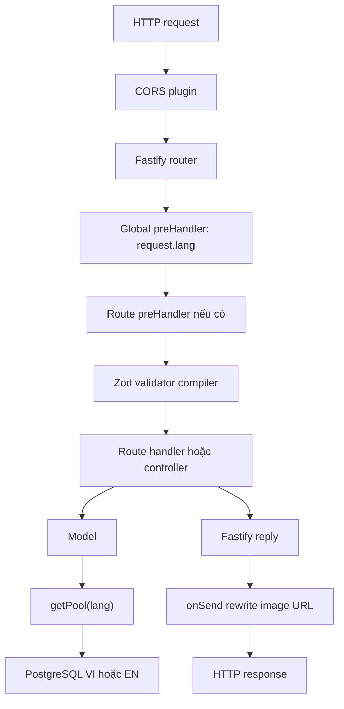
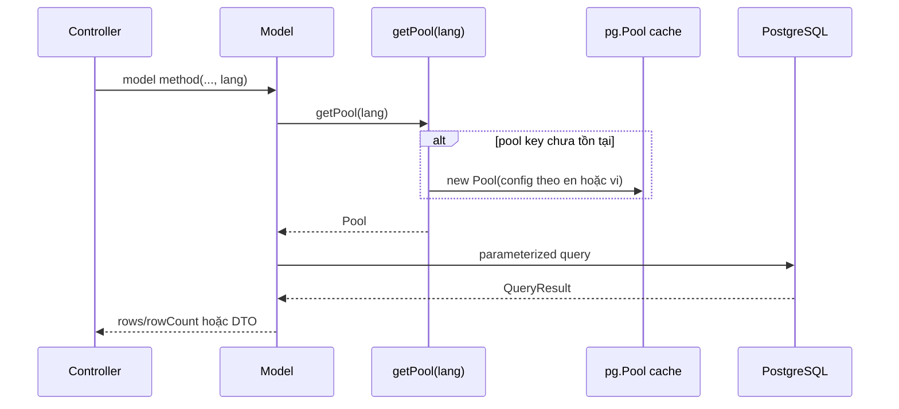
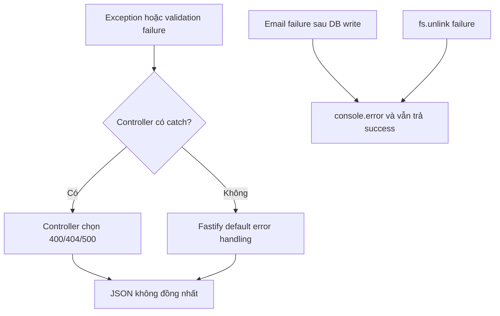

# Kiến trúc Backend

## 1. Kiểu kiến trúc thực tế

Ứng dụng áp dụng kiến trúc phân lớp nhẹ theo chuỗi `Route -> Controller -> Model -> PostgreSQL`, gần với MVC phía server nhưng không có View và không có lớp Service độc lập nhất quán.

| Lớp | Trách nhiệm thực tế | Ngoại lệ đáng chú ý |
|---|---|---|
| Bootstrap | Tạo Fastify, plugin, hook, static, route và listen | Toàn bộ nằm trong IIFE ở `src/index.ts` |
| Route | Khai báo HTTP method/path, Zod schema, handler adapter | Nhiều route chứa auth/404 logic trực tiếp |
| Controller | Điều phối model, response, mail, Excel | Một số controller chỉ bọc model; workshop chứa nhiều business logic |
| Model | SQL trực tiếp hoặc store in-memory | Không có repository abstraction/transaction layer |
| Utility | JWT, mail, URL, error class | `AppError` và `formatImageUrl` chưa được dùng |
| Middleware/hook | Chuẩn bị upload path, gán ngôn ngữ, rewrite ảnh | Auth middleware/hook là no-op |

## 2. Bootstrap và plugin order

`src/index.ts` tạo server với logger, bỏ qua trailing slash và cho phép path parameter dài tối đa 1000 ký tự. Trình tự đăng ký:

1. CORS có credentials và callback origin.
2. Tạo thư mục `public/` nếu chưa tồn tại; đăng ký static prefix.
3. `@fastify/sensible`.
4. Zod validator/serializer compiler.
5. Cookie và Fastify session; cookie session có `secure: false`.
6. Multipart: tối đa 20.000.000 byte/file, tối đa 10 file/request; upload handler chỉ gọi `request.file()` một lần.
7. Global `preHandler` gán `request.lang = request.query.lang ?? "vi"`.
8. Root health/welcome routes.
9. Global `onSend` rewrite image path.
10. Đăng ký 18 route group dưới `DEFAULT_API_PREFIX`.
11. Listen `0.0.0.0:<PORT>`; lỗi startup làm `process.exit(1)`.

## 3. Request lifecycle chi tiết

### 3.1 Chọn ngôn ngữ

- Type toàn cục khai báo `LangType = "vi" | "en"`, nhưng runtime không validate query.
- Mọi request có query object sẽ nhận `request.lang` từ `?lang=` hoặc `vi`.
- `getPool(lang)` dùng cấu hình EN chỉ khi `lang === "en"`; mọi chuỗi khác dùng credentials/database VI.
- `services.route.ts` không dùng `request.lang` cho quote requests, mà lấy header `x-custom-lang` hoặc `vi`.
- `search.controller.ts` tự đọc query `lang`, trùng với global hook.

### 3.2 Validation

`validatorCompilerPlugin` cài compiler của `fastify-type-provider-zod`. Route có `schema.body`, `schema.params` hoặc `schema.querystring` được Fastify validate trước handler. Khi lỗi, Fastify dùng error response mặc định vì ứng dụng không cài global error handler.

Không đồng nhất:

- Careers import schema nhưng route không gắn schema; controller tự `.parse()` khi create/update.
- Workshop `find`, absence, delete absence và profile update ép kiểu TypeScript nhưng không runtime validation.
- Services delete không có schema params.
- Upload không kiểm tra MIME/extension; extension lấy từ tên file client.
- Các list/detail/delete CMS thường không validate `id`.

### 3.3 Handler và response

- Handler Fastify có thể return object hoặc gọi `reply.send()`.
- Controller CRUD PostgreSQL thường `try/catch`, gửi `{data}`, `{message,data}`, 404 hoặc 500.
- Product/services/workshop wrapper thường để exception bubble lên Fastify; lỗi có thể mang format mặc định.
- Không có response envelope thống nhất.

### 3.4 `onSend` ảnh

Nếu serialized payload là string chứa `"public/static/images/`, hook thay mọi occurrence bằng URL `SERVER_PROTOCOL://SERVER_DOMAIN<BASE_PATH>/public/static/images/...`. Hook không rewrite chuỗi bắt đầu `/public/...`, không xử lý object trước serialization và không dùng utility `formatImageUrl()`.

## 4. Database architecture

### 4.1 Pool lifecycle

- Cache là `Partial<Record<string, Pool>>`, lazy-init theo chính chuỗi `lang`.
- Pool config: `max=500`, `idleTimeoutMillis=30000`, `connectionTimeoutMillis=2000`.
- SSL chỉ bật với `{rejectUnauthorized:false}` nếu host chứa chuỗi `supabase`.
- Không có hook close pool khi shutdown, health check database, retry policy hoặc transaction helper.
- Giá trị dữ liệu đều dùng placeholder `$n`. Riêng tên cột update được sinh từ key đã qua Zod ở hầu hết model; careers tự parse trong controller.

### 4.2 Kiểu lưu trữ

| Module | Storage |
|---|---|
| Accounts, CMS, people, products, DIY, short courses, bookings, quote requests, search | PostgreSQL |
| Workshop landing list | Mảng tĩnh trong module |
| Contact details/inquiries | Object/mảng in-memory |
| Member registrations | Mảng in-memory |
| Uploaded media | Local filesystem |

## 5. Authentication và authorization architecture

### 5.1 Token

- `signSessionToken()` tạo JWT HS256 bằng `SESSION_TOKEN_SECRET`, mặc định hết hạn `7d`.
- `verifySessionToken()` chỉ cấu hình key; thư viện xác minh chữ ký và expiration.
- Client gửi raw token trong `Authorization`; code không bóc prefix `Bearer `.
- Cookie/session plugin không tham gia luồng token.
- `JWT_SECRET` không được dùng.

### 5.2 Điểm enforcement

| Endpoint | Cách kiểm tra |
|---|---|
| `POST /users/checked-valid-session` | Verify raw Authorization token |
| `GET /users/profile` | Verify token, lookup guest rồi member |
| `PUT /users/profile` | Verify token, chỉ cập nhật khi lookup được guest |
| `GET /workshops/registrations/me` | Verify token, lookup account và email |
| Tất cả endpoint khác | Không kiểm tra auth/role |

`role` được ký vào token nhưng không endpoint nào so sánh role/permission. Hai file `auth.hook.ts` và `auth.middleware.ts` trả về ngay và không được register.

## 6. Tích hợp ngoài và side effects

### 6.1 Gmail

Transporter tạo ở module load bằng Gmail service. Booking insert/status và quote insert thực hiện database trước, rồi gửi email trong `try/catch`; lỗi email chỉ log. Riêng register guest chưa ghi database, và lỗi gửi mail làm request trả 500.

### 6.2 Filesystem

Upload middleware resolve thư mục đích, chặn raw path chứa `..` và kiểm tra prefix. Handler stream file ra disk với tên timestamp/random. Staff/technicals/intern update/delete xóa ảnh cũ bất đồng bộ bằng `fs.unlink`; path được `path.join(process.cwd(), oldImage)` mà không kiểm tra lại boundary.

### 6.3 Excel và Google Sheets

- Excel export đọc toàn bộ bookings, sort trong memory, chèn dòng phân nhóm tháng và trả buffer.
- Google Sheets controller tạo JWT service account và thêm row vào sheet đầu tiên, nhưng không có route gọi controller này.

## 7. Error flow

Không có `server.setErrorHandler`, không dùng `AppError`, không có correlation ID hoặc domain error mapping.

## 8. Các boundary kiến trúc quan trọng

- Không có transaction giữa DB và email/filesystem.
- Không có service layer dùng chung; controller workshop vừa lookup nội dung, gửi mail và tạo Excel.
- Không có dependency injection; model singleton hoặc `new AccountModel()` trực tiếp.
- Không có cache ngoài các mảng tĩnh và cache pool.
- Không có rate limiting, CSRF, Helmet, audit log, OpenAPI hoặc request-id tùy biến.
- Không có graceful shutdown cho HTTP server/pool.

