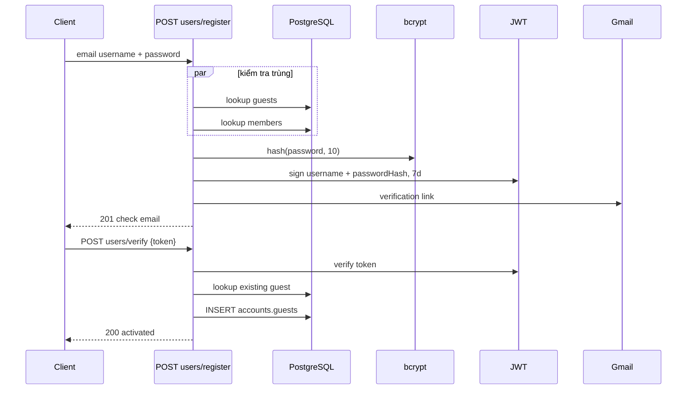

# Xác thực và phân quyền

## 1. Kết luận hiện trạng

Hệ thống có cơ chế phát/xác minh JWT nhưng chưa có kiến trúc phân quyền được enforce toàn cục. Bốn endpoint tự kiểm tra token; toàn bộ CRUD CMS, people, products, booking admin, quote admin và upload không yêu cầu auth trong code.

## 2. Token format và truyền token

| Thuộc tính | Giá trị thực tế |
|---|---|
| Library | `fast-jwt` |
| Algorithm khi sign | HS256 |
| Key | `SESSION_TOKEN_SECRET` |
| Expiration | `7d` |
| Transport | Raw JWT trong header `Authorization` |
| Bearer support | Không; chuỗi `Bearer <jwt>` sẽ bị verify như toàn bộ token và thất bại |
| Refresh token | Không có |
| Revocation/logout | Không có |
| Cookie session | Plugin có đăng ký nhưng auth flow không sử dụng |

Hai payload:

```json
{"userId":"<db id>","username":"<account username>","role":"guest|member|db role"}
```

```json
{"username":"<registration email>","passwordHash":"<bcrypt hash>"}
```

Payload thứ hai là verification token; cùng secret và thời hạn với session token.

## 3. Password login

```mermaid
sequenceDiagram
    participant C as Client
    participant R as POST users/login
    participant A as AccountModel
    participant D as PostgreSQL
    participant B as bcrypt
    participant J as fast-jwt
    C->>R: username, password, auth_provider khác google
    R->>A: findMemberByEmail(username, lang)
    A->>D: SELECT accounts.members
    alt không có member
        R->>A: findGuestByUsername(username, lang)
        A->>D: SELECT accounts.guests
    end
    alt không có account
        R-->>C: 404
    else có account
        R->>B: compare(password, account.password)
        alt mismatch
            R-->>C: 401
        else match
            R->>J: sign userId, username, role; 7d
            R-->>C: 200 token + expires
        end
    end
```

Password database được giả định là bcrypt hash; code không kiểm tra `status`, verified flag hoặc disabled account.

## 4. Google/whitelist login

Nhánh được kích hoạt chỉ bởi `auth_provider === "google"` trong body. Controller:

1. Dùng `username` như email để query `accounts.members`.
2. Nếu có row, ký session token ngay.
3. Không nhận hoặc xác minh Google ID token/access token.
4. Không kiểm tra audience, issuer, signature, email_verified hoặc nonce.

> Đây là whitelist-by-email, không phải OAuth/OpenID Connect hoàn chỉnh. Client có thể tự gửi `auth_provider: "google"`; do đó bất kỳ email member biết được có nguy cơ bị mạo danh.

## 5. Register và verification



Không có pending-registration table; password hash nằm trong JWT gửi qua URL query của email link. Link cố định locale `/vi/login` dù request register dùng DB EN. Hai verify request đồng thời có thể race; unique constraint DB có thể làm một request trả 500.

## 6. Session validation và profile

| Route | Enforcement | Authorization sau auth |
|---|---|---|
| `checked-valid-session` | Verify token | Không lookup account; account đã xóa vẫn có thể token-valid |
| `GET profile` | Verify, lookup guest/member | Bất kỳ account tìm thấy |
| `PUT profile` | Verify, lookup guest | Guest được update chính username từ token; member bị 403 |
| `registrations/me` | Verify, lookup account/email | Chỉ booking matching email |

`checked-valid-session` trả `expires = now + 7d`; không phản ánh `exp` thật và có thể gây client hiểu nhầm token được gia hạn. Không token mới được phát.

## 7. Role và permission

- Token chứa `role` nhưng code không kiểm tra claim này.
- Không có enum role, permission matrix, ownership guard hoặc admin guard.
- `UserModel.createAdminUser()` có thể tạo role `admin` nhưng model không được gọi.
- `authHook` và `authMiddleware` là no-op và không được register.
- Các endpoint thay đổi/xóa dữ liệu đều public, bao gồm đổi trạng thái booking và export PII.

### Ma trận enforcement hiện tại

| Nhóm | Read | Write/admin |
|---|---|---|
| CMS, people, products, categories | Public | Public |
| DIY/short courses | Public | Public |
| Booking | Public; riêng `/me` có token | Create/update/delete/export public |
| Quote requests | Public | List/delete public |
| Upload | Public | Public |
| Profile | Token | Guest-own profile only |

## 8. Session cookie plugin

Fastify cookie/session được register với `SESSION_TOKEN_SECRET`, cookie `{secure:false}`. Không route nào đọc/ghi `request.session`; type declaration chỉ thêm `cookies.sessionToken?`, nhưng code cũng không dùng cookie đó. Vì vậy mô tả hệ thống là JWT header-based, không phải cookie-session-based.

## 9. Security notes theo mức ưu tiên

### Khẩn cấp

1. Bảo vệ toàn bộ write/admin/export/upload route bằng middleware thật và RBAC deny-by-default.
2. Thay Google branch bằng xác minh Google ID token server-side; đối chiếu audience/issuer/email_verified rồi mới whitelist.
3. Xóa secret fallback khỏi source, rotate secret đã từng dùng và bắt buộc env production.
4. Không nhận raw token; chuẩn hóa `Authorization: Bearer <token>` và không log token.

### Cao

1. Tách verification token khỏi session token: secret/audience/purpose/thời hạn ngắn; không nhét password hash vào URL token.
2. Thêm refresh token rotation hoặc session store/revocation; logout và account disable check.
3. Trả 401 thống nhất cho invalid/expired token, không 500.
4. Thêm rate limit cho login/register/verify/find/upload và chống brute-force.
5. Đặt cookie `secure`, `httpOnly`, `sameSite` nếu quyết định dùng cookie; nếu không, bỏ plugin session để giảm hiểu nhầm.

### Trung hạn

- Permission matrix rõ ràng: public reader, guest/member, content editor, booking operator, admin.
- Audit log cho create/update/delete/status/export.
- Ownership check cho absence request và booking lookup.
- Không trả PII toàn bộ qua endpoint public.

