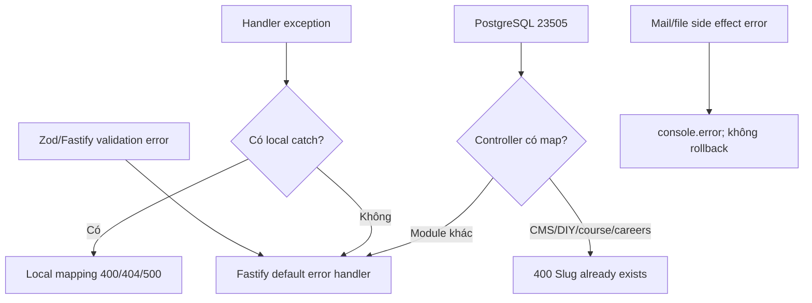

# Xử lý lỗi

## 1. Mô hình hiện hành

Ứng dụng không cài `server.setErrorHandler`. Error được xử lý theo ba kiểu:

1. Controller CRUD dùng `try/catch` rồi tự gửi 400/404/500.
2. Inline/controller không catch, để Fastify error handler mặc định xử lý.
3. Side effect email/xóa ảnh dùng `try/catch` hoặc callback log-only, trong khi request chính vẫn success.

`AppError(message,statusCode)` tồn tại trong `src/utils/errors.ts` nhưng không được import sử dụng.



## 2. Status code được dùng

| Code | Nguồn/hành vi |
|---|---|
| 200 | GET/PUT/PATCH/DELETE thông thường; verify/profile; nhiều create controller cũng mặc định 200 |
| 201 | Guest register; Google Sheets controller không có route |
| 400 | Request auth thiếu password/token; query search thiếu; duplicate slug; careers Zod; multipart không có file; Fastify validation |
| 401 | Password sai; thiếu/sai session ở explicit checks |
| 403 | Member cố update profile; login type signature dự kiến 403 nhưng controller login không phát 403 |
| 404 | Account/resource không tồn tại |
| 409 | Email đã đăng ký; guest đã verify |
| 500 | Local catch chung; upload; search; Fastify unhandled errors |

Không có 204, 422, 429 hoặc 503 trong code.

## 3. Error response shapes

Không có chuẩn duy nhất:

```json
{"message":"Internal Server Error"}
```

```json
{"message":"Validation error","errors":[{"path":["title"],"message":"..."}]}
```

```json
{"status":400,"message":"Query parameter 'q' is required"}
```

```json
{"status":500,"message":"Internal server error","error":"<raw error.message>"}
```

Fastify validation/unhandled response có shape phụ thuộc version/framework vì không custom handler. Một số message tiếng Việt trong source đang có dấu hiệu sai encoding (mojibake).

## 4. Mapping theo module

| Module | Mapping đặc biệt | Khoảng trống |
|---|---|---|
| News/events/student life/DIY/short courses | `23505` -> 400 slug exists | Các DB code khác -> 500 |
| Careers | Tự Zod parse -> 400 errors; `23505` -> 400 | Route schema không hoạt động |
| People | 404 theo entity, còn lại 500 | Unique/FK không phân loại |
| Products | Inline 404 khi boolean/null | DB/parse lỗi dùng Fastify default |
| Booking | 404 chỉ ở find; model rowCount 0 thì throw generic | Update/delete not-found có thể thành 500 |
| Users | 400/401/404/409 cục bộ | JWT invalid ở profile/verify có thể thành 500 |
| Search | 400 thiếu q; 500 kèm raw message | Lộ chi tiết nội bộ |
| Services | Không local catch ở route/controller chính | Default framework response |
| Upload | 400 no file; catch mọi lỗi -> 500 | Path middleware throw xảy ra trước handler catch |

## 5. Tính nguyên tử và lỗi side effect

- Booking insert commit trước email; email failure không rollback.
- Booking status commit trước email status; mail failure vẫn trả booking updated.
- Quote request insert trước hai email; một trong hai reject làm `Promise.all` reject nhưng catch và vẫn trả success.
- Staff/technicals/intern update/delete DB trước khi xóa file; lỗi xóa chỉ log.
- Upload có thể để file dở dang nếu stream/input lỗi; không cleanup.
- Không transaction đa-query trong product lookup+insert/update hoặc account verification.

## 6. Logging

- Fastify logger bật toàn cục và log startup/request theo framework.
- Code dùng cả `server.log.error`, `console.error`, `console.log`.
- Không có cấu trúc log domain, request correlation ID do ứng dụng quản lý, redaction hoặc audit log.
- Search trả `error.message` cho client; token validation log raw error.

## 7. Error classes

| Class | Fields | Sử dụng |
|---|---|---|
| `AppError` | `message`, `statusCode` default 500, name `AppError` | Không dùng |
| Built-in `Error` | Message `Booking not found`, `No data to update`, path errors | Có, thường bị map mặc định |
| ZodError | issues/errors | Fastify compiler hoặc careers controller |
| PostgreSQL error | `code`, message, constraint metadata | Chỉ code `23505` được bắt ở một số controller |

## 8. Khuyến nghị chuẩn hóa

Đề xuất envelope:

```json
{
  "error": {
    "code": "RESOURCE_NOT_FOUND",
    "message": "Resource not found",
    "details": [],
    "requestId": "<id>"
  }
}
```

Thứ tự triển khai:

1. Tạo domain errors (`ValidationError`, `UnauthorizedError`, `ForbiddenError`, `NotFoundError`, `ConflictError`, `DependencyError`).
2. Cài một `setErrorHandler` map Zod/Fastify/PostgreSQL/domain errors; không trả stack/raw DB message.
3. Đổi model/controller not-found từ generic throw sang `NotFoundError`.
4. Chuẩn hóa status create thành 201 và delete thành 204 hoặc 200 nhất quán.
5. Thêm request ID và structured logger; redaction Authorization/password/token.
6. Xác định semantics side effect: outbox/retry cho email, cleanup file, transaction khi cần.
7. Thêm contract tests cho mọi error shape trước khi thay đổi client.

