# Triển khai Backend

## 1. Runtime và build

CI chính thức dùng Node.js 20 trên Ubuntu. TypeScript target ES2022/NodeNext. Repository có `package-lock.json`, vì vậy workflow chọn `npm ci`.

| Lệnh | Hành vi |
|---|---|
| `npm run dev` | `npx nodemon`; watch `src`, `config.ts`; chạy `tsx src/index.ts` |
| `npm run build` | Xóa `dist`, chạy `tsc`, rồi `tsc-alias` |
| `npm start` | `node dist/index.js` |
| `npm run lint` | ESLint toàn repository |
| `npm run lint:fix` | ESLint có sửa tự động |

Kiểm chứng ngày 04/08/2026: `npx tsc --noEmit` pass; lint fail 85 lỗi. Không có test script.

## 2. Cấu hình môi trường

### 2.1 Biến được `config.ts` đọc

| Biến | Bắt buộc production | Default/logic |
|---|---|---|
| `PORT` | Nên có | `4000` |
| `BASE_PATH` | Theo hosting | Windows mặc định rỗng; OS khác mặc định `/makerspace_server` |
| `POSTGRES_DB_HOST` | Fallback chung | Có fallback hard-code không an toàn |
| `POSTGRES_DB_HOST_VI`, `POSTGRES_DB_HOST_EN` | Nên tách rõ | Fallback `POSTGRES_DB_HOST` |
| `POSTGRES_USER` | Fallback chung | Có fallback hard-code |
| `POSTGRES_USER_VI`, `POSTGRES_USER_EN` | Nên tách rõ | Fallback `POSTGRES_USER` |
| `POSTGRES_PASSWORD` | Fallback chung | Có fallback secret trong source |
| `POSTGRES_PASSWORD_VI`, `POSTGRES_PASSWORD_EN` | Bắt buộc | Fallback password chung/source |
| `POSTGRES_DB_VI`, `POSTGRES_DB_EN` | Bắt buộc | `makerspace_vi`, `makerspace_en` |
| `POSTGRES_DB_PORT` | Có | `5434` |
| `SESSION_TOKEN_SECRET` | Bắt buộc, mạnh | Có fallback source; dùng JWT và session plugin |
| `JWT_SECRET` | Không tác động hiện tại | Được load nhưng không dùng |
| `CORS_ORIGIN` | Cần cho verification link | Không quyết định CORS allowlist runtime |
| `SERVER_PROTOCOL` | Bắt buộc đúng | `http` |
| `SERVER_DOMAIN` | Bắt buộc đúng | `localhost:<PORT>` |
| `EMAIL_APP_USERNAME` | Bắt buộc cho mail | rỗng |
| `EMAIL_APP_PASS` | Bắt buộc cho mail | rỗng |
| `EMAIL_RECEIVER` | Bắt buộc cho báo giá admin | `makerspace@ueh.edu.vn` |
| `GOOGLE_SERVICE_ACCOUNT_EMAIL` | Chỉ code Sheets không routed | rỗng |
| `GOOGLE_PRIVATE_KEY` | Chỉ code Sheets không routed | rỗng; xử lý `\\n` |
| `GOOGLE_SHEET_ID` | Chỉ code Sheets không routed | rỗng |
| `MEDIA_UPLOAD_FOLDER` | Có | `public/static` |

File `.env` hiện có trong working tree nhưng bị gitignore. Không có `.env.example`. Tài liệu không sao chép giá trị secret.

### 2.2 URL và base path

Với production shared hosting mặc định non-Windows:

- API prefix: `/makerspace_server/api`.
- Static prefix: `/makerspace_server/public/`.
- Root route `/makerspace_server` và ping vẫn được khai báo tuyệt đối, độc lập `BASE_PATH`.
- Image rewrite: `${SERVER_PROTOCOL}://${SERVER_DOMAIN}${BASE_PATH}/public/static/images/...`.

Phải test đồng thời reverse proxy path, `BASE_PATH`, static prefix và URL rewrite để tránh nhân đôi `/makerspace_server`.

## 3. Database readiness

Ứng dụng không migrate database và không test connection lúc startup. Pool chỉ kết nối khi request đầu tiên gọi model. Cần provision trước các schema/table liệt kê trong `01-project-overview.md`.

Checklist:

- Cả DB VI/EN có schema/table/column tương thích.
- User có SELECT/INSERT/UPDATE/DELETE cần thiết.
- Network/port và TLS hoạt động; host chứa `supabase` tự bật TLS không verify CA.
- Số connection cho phép chịu được tối đa `500 x số pool/process`; nên giảm theo capacity thực.
- Index cho slug, publish_date, created_at, username, booking email/contact và search fields.
- Backup/restore được kiểm thử ngoài repository.

## 4. Static và upload files

- Server startup tự tạo `<cwd>/public`.
- Static root là `<cwd>/public`.
- Upload root mặc định là `<cwd>/public/static/images`.
- File upload là state local; khi scale nhiều instance cần shared volume/object storage.
- Staff/technicals/intern update/delete có thể xóa path ảnh liên quan.

> Workflow tạo zip trước khi start server và chạy `zip -r deploy.zip dist public package.json package-lock.json`. Repository sạch hiện không có `public/`; cần tạo/track `public/.gitkeep` hoặc làm workflow conditional, nếu không zip có thể báo không tìm thấy path.

## 5. CI/CD thực tế

```mermaid
flowchart LR
    Push["Push main hoặc workflow_dispatch"] --> Checkout["actions/checkout@v4"]
    Checkout --> Detect["Detect yarn.lock/package-lock"]
    Detect --> Node["setup-node Node 20 + cache"]
    Node --> Install["npm ci"]
    Install --> Build["npm run build"]
    Build --> Zip["zip dist public package files"]
    Zip --> Artifact["Upload artifact, 1 day"]
    Artifact --> Download["Deploy job download"]
    Download --> FTP["FTP only deploy.zip to makerspace_server/"]
    FTP --> Hook["curl unzip.php with key in URL"]
```

Workflow `.github/workflows/deploy-makerspace.yml`:

- Trigger push `main` hoặc manual.
- Concurrency không cancel deployment đang chạy.
- Artifact tên `makerspace-api-zip`, retention 1 ngày.
- FTP secrets: `FTP_SERVER`, `FTP_USERNAME`, `FTP_PASSWORD`.
- FTP action exclude tất cả ngoài `deploy.zip`.
- Cuối cùng gọi URL unzip production; key đang hard-code trong workflow URL.

Không thấy bước lint, test, vulnerability scan, migration, smoke test, health gate hoặc rollback.

## 6. Cài đặt production trên shared hosting

Sau khi remote unzip, package chứa `dist`, `public`, `package.json`, `package-lock.json`; không chứa `node_modules` hay `.env`. Máy đích phải:

1. Có Node.js tương thích (nên Node 20 như CI).
2. Cung cấp `.env` ngoài artifact.
3. Chạy `npm ci --omit=dev` sau unzip; workflow hiện không cho thấy bước này, có thể webhook thực hiện nhưng source không chứng minh.
4. Restart process manager/cPanel Node app; workflow không thể hiện lệnh restart.
5. Đặt working directory đúng để `process.cwd()` trỏ tới thư mục có `public`.
6. Expose port/reverse proxy và giữ persistent upload directory.

Các bước 3-4 là thông tin vận hành còn thiếu cần xác nhận với owner `unzip.php`.

## 7. CORS và network

CORS runtime không dùng `CORS_ORIGIN`; callback cho phép:

- Request không có Origin.
- Host `localhost`, `127.0.0.1`.
- Host kết thúc `ueh.edu.vn`.
- Host chứa chuỗi `vercel.app`.

Credentials bật, methods gồm GET/POST/PUT/PATCH/DELETE/OPTIONS. Không cấu hình allowHeaders riêng. Cần lưu ý `hostname.includes("vercel.app")` rộng hơn suffix check.

## 8. Deployment checklist

### Trước deploy

- [ ] `npm ci` thành công trên Node 20.
- [ ] `npx tsc --noEmit` và `npm run build` thành công.
- [ ] Lint/test gate được quyết định rõ; hiện lint đang đỏ và không có tests.
- [ ] So sánh database schema VI/EN.
- [ ] Kiểm tra toàn bộ env, không dùng fallback secret.
- [ ] Xác nhận `BASE_PATH`, domain, protocol, verification URL.
- [ ] Tạo `public` và backup upload hiện hữu.
- [ ] Rotate webhook key hard-code và FTP secrets nếu đã lộ.

### Sau deploy

- [ ] Kiểm tra `/health`, `/makerspace_server/ping`, `/api/utils/meta` theo URL thực.
- [ ] Kiểm tra một query DB VI và EN bằng `?lang=`.
- [ ] Kiểm tra static image URL và upload path.
- [ ] Kiểm tra login/password, verification email và mail quote/booking.
- [ ] Kiểm tra export XLSX.
- [ ] Xác nhận process restart tự động và log không chứa secret/token.
- [ ] Theo dõi connection pool, disk, SMTP errors và 5xx.

### Rollback

Repository không định nghĩa rollback. Cần lưu artifact trước, snapshot upload, giữ `.env`, ghi version deploy và có thao tác switch/restart xác định ở cPanel. Database rollback phải độc lập vì không có migration framework.

