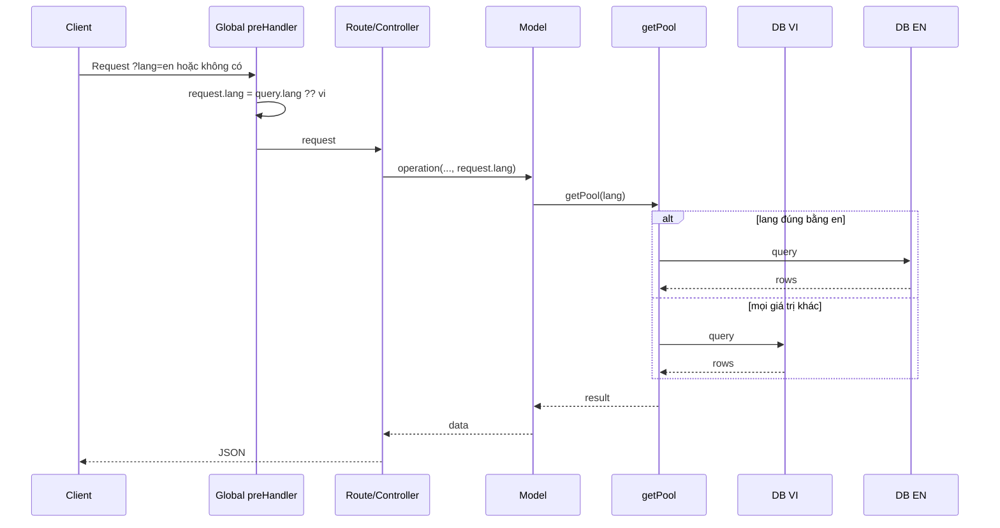
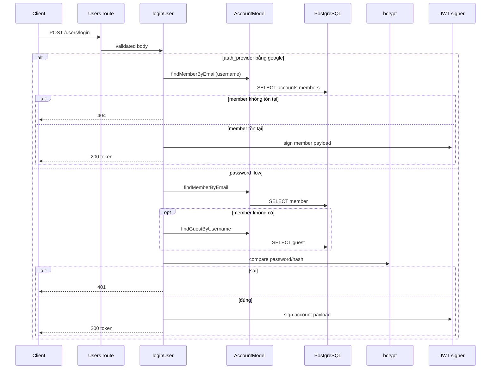
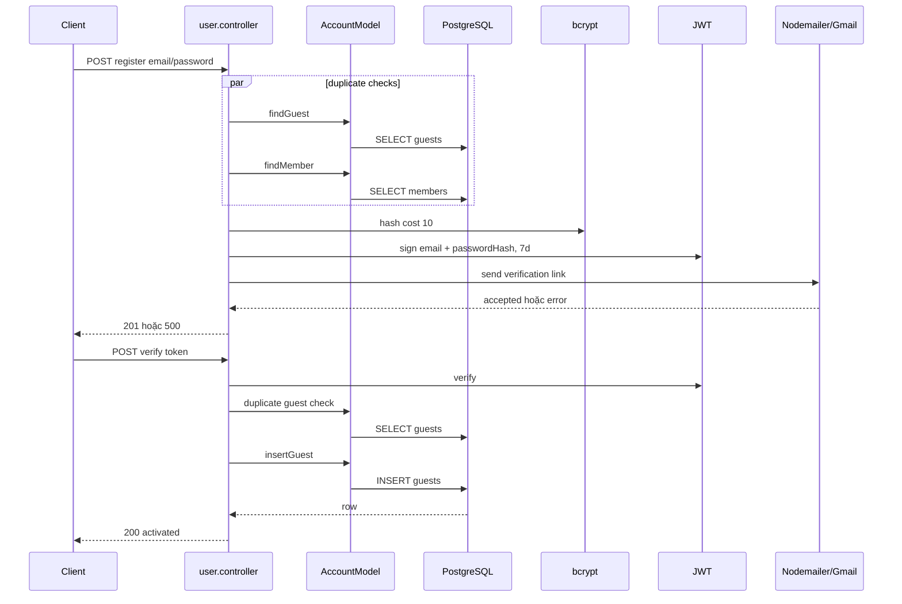
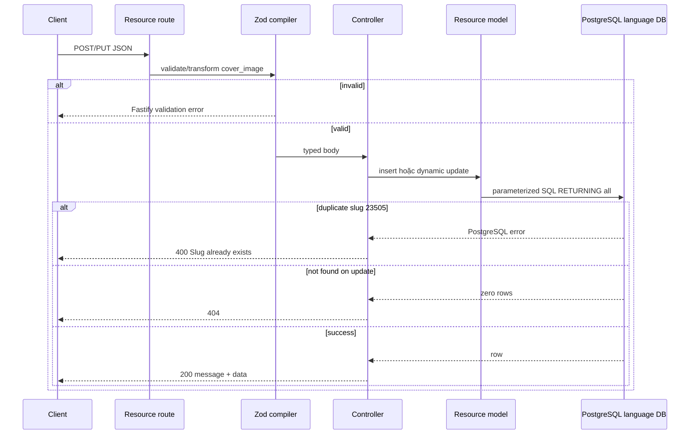
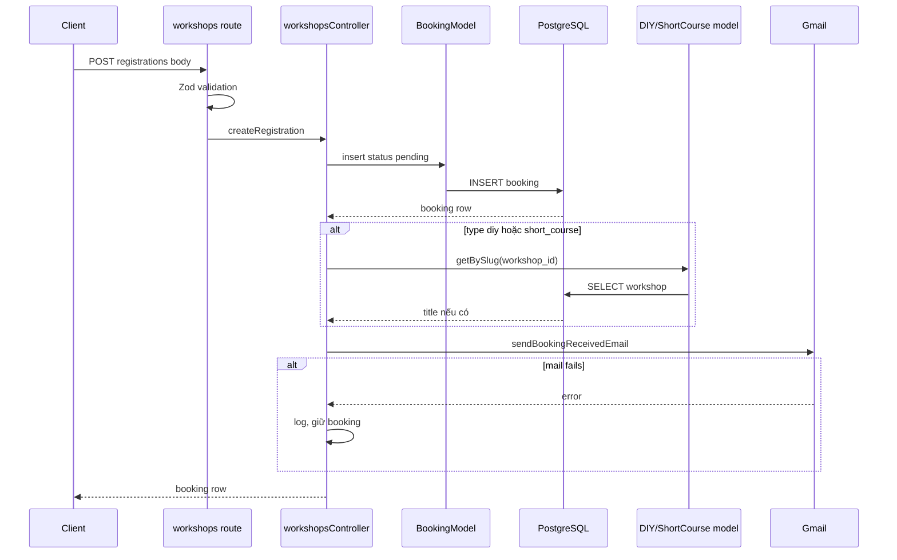
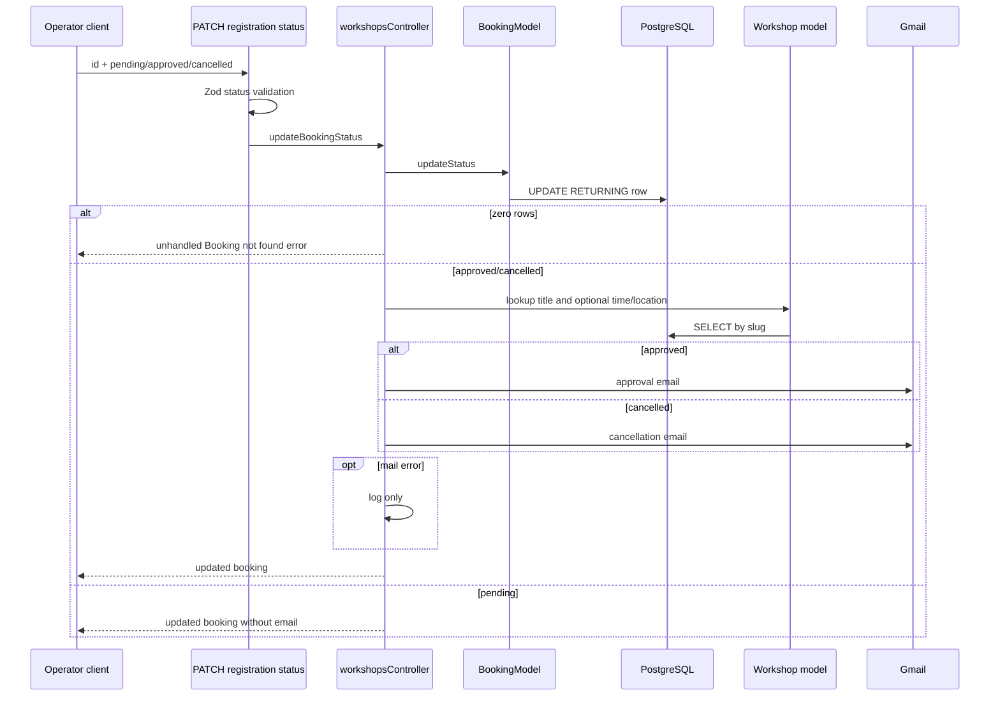
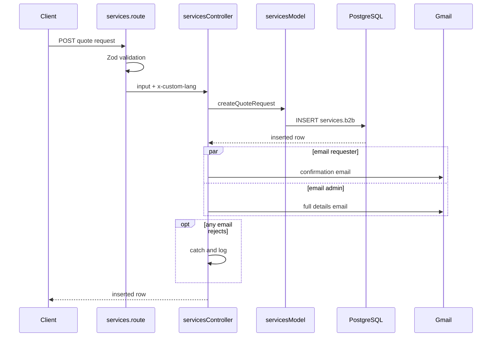
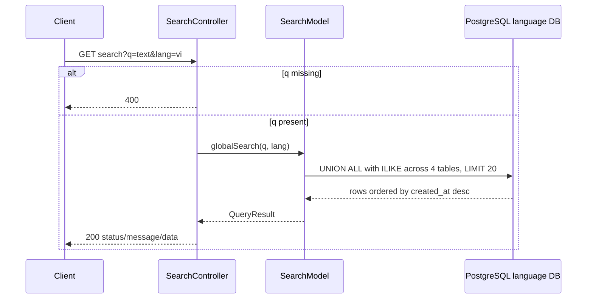
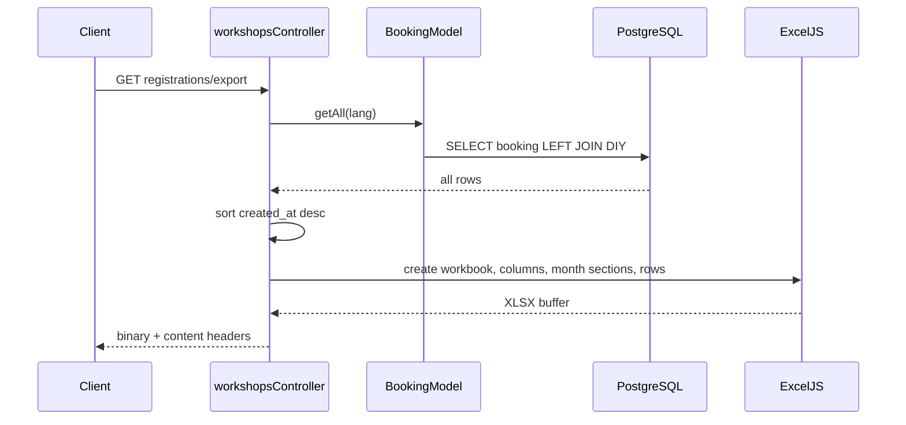
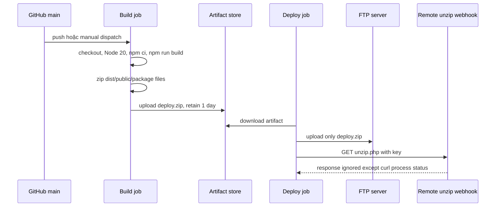

# Quy trình nghiệp vụ và sơ đồ tuần tự

> Sơ đồ chỉ thể hiện các thành phần thực sự có trong code. Không có lớp Service độc lập cho đa số module; node `Controller` bên dưới chính là nơi điều phối. Repository không có cronjob/queue/worker đang hoạt động.

## 1. Chọn database song ngữ



Ngoại lệ: quote requests lấy `x-custom-lang`; search tự đọc query `lang`.

## 2. Login password và Google whitelist



Google branch không gọi Google API và không xác minh ID token.

## 3. Đăng ký và kích hoạt guest



## 4. CRUD nội dung CMS

Áp dụng cho news/events/student life; careers khác ở chỗ controller tự Zod parse và model không set `updated_at`.



Không có auth node vì route hiện không đăng ký auth guard.

## 5. Product create/update

```mermaid
sequenceDiagram
    participant C as Client
    participant R as products.route
    participant P as productsController/model
    participant D as PostgreSQL
    C->>R: POST hoặc PUT product body
    R->>R: Zod validate và strip image origin
    R->>P: create/update
    P->>D: SELECT category id WHERE name exact
    D-->>P: id hoặc empty
    P->>P: generate slug/create; parse price; build specs JSON
    alt create
        P->>D: INSERT products.items RETURNING id
    else update
        P->>D: UPDATE products.items
    end
    P->>D: SELECT item LEFT JOIN category
    D-->>P: row
    P->>P: map DTO và format giá vi-VN
    P-->>C: product object hoặc 404
```

## 6. Upload file và phục vụ ảnh

```mermaid
sequenceDiagram
    participant C as Client
    participant R as POST upload wildcard
    participant M as processUploadPath
    participant F as Filesystem
    participant S as Static plugin
    C->>R: multipart file at /upload/subpath
    R->>M: preHandler
    M->>M: derive rawPath; reject dot-dot; boundary check
    M->>F: mkdir recursive if missing
    M-->>R: request.path.fullPath
    R->>R: request.file; timestamp/random filename
    R->>F: stream file
    F-->>R: write completed
    R-->>C: relative public/static/images URL
    C->>S: GET static URL
    S->>F: read file
    F-->>S: bytes
    S-->>C: file response
```

Handler không kiểm tra MIME và chỉ đọc một file dù plugin limit cho tối đa 10.

## 7. Đăng ký workshop và email received



## 8. Duyệt/hủy booking



Endpoint operator hiện không có auth/RBAC.

## 9. Báo giá dịch vụ



## 10. Global search



## 11. Export booking Excel



Không có streaming/pagination và không có auth.

## 12. CI/CD deployment



## 13. Cronjob và đồng bộ dữ liệu

Không có cron, scheduler runtime, queue, worker hoặc route đồng bộ dữ liệu trong repository. `schedules.model.ts` là CRUD table workshop schedule nhưng không được route/controller sử dụng. `registration.controller.ts` có luồng ghi Google Sheet nhưng không được đăng ký route, nên không phải workflow runtime.

